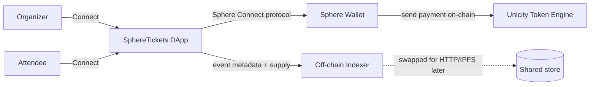

# SphereTickets — On-chain Event Ticketing DApp

An on-chain event ticketing platform built on the **Unicity Sphere SDK** (`@unicitylabs/sphere-sdk`),
targeting **testnet2**. Organizers create events and sell blockchain-backed tickets; attendees
connect a Sphere wallet, browse events, and buy tickets. Each ticket is represented by a
real on-chain transfer recorded by the Unicity token engine.

---

## ⚠️ IMPORTANT: Spec reinterpretation (read first)

The original brief was written for an **EVM / Solidity** stack (smart contract, ERC-721 NFT,
`createEvent()`/`purchaseTicket()` as contract functions, USDC, Chain ID, etc.).

**The Unicity Sphere network is NOT EVM.** It has no Solidity contracts and no native ERC-721
NFT primitive, and the public SDK exposes **no `createCoin`/`registerCoin`**. After auditing the
real SDK source (`payments-v2`, `token-engine`, `registry`), the brief was reinterpreted onto
Sphere's actual primitives with your explicit approval. The mapping is:

| EVM spec concept            | Sphere reinterpretation (real, enforced)                                  |
|-----------------------------|---------------------------------------------------------------------------|
| Smart contract              | Sphere token engine (UTXO-style, fungible) — no user-deployed contract    |
| 1 ticket = 1 NFT            | 1 issued ticket = 1 real on-chain transfer; its `transferId` is the `tokenId` |
| `ticketId` / `tokenId`      | On-chain transfer id (verifiable in wallet history)                       |
| `contract address`          | `ticketCoinId` (the coin the ticket is paid/issued in)                    |
| `createEvent()` on-chain    | Organizer records event metadata + supply in an **off-chain indexer**     |
| `purchaseTicket()` atomic   | Attendee performs a **real on-chain payment** (`send`); ticket issued on confirm |
| Price enforced by contract  | Price enforced by the token engine (insufficient balance ⇒ send rejected)  |
| Supply enforced by contract | Supply counter in the indexer + 1:1 issue logic (see Known Limitations)   |
| Ownership                   | Token-engine ownership of the payment transfer (riil, verifiable)         |

This is documented honestly so no on-chain fact is fabricated (spec #13 / #17).

---

## Features (V1 core)

- Wallet connect via **Sphere Connect protocol** (iframe / extension / popup) — no seed phrase ever touched (spec #17).
- Organizer: create event (name, description, image, location, start/end, price, supply) with full validation.
- Attendee: explore events, view event detail, buy ticket (real on-chain payment + issued ticket).
- My Tickets: tickets owned by the connected wallet, with tokenId / event / owner / tx.
- Organizer dashboard: totals (events, sold, revenue) + per-event stats + ticket holders (organizer-only).
- Clear transaction states: preparing → awaiting wallet → submitted → confirming → minted / failed (spec #8).
- Human-readable errors: wrong network, rejected tx, insufficient balance, disconnected (spec #12).

---

## Architecture



- **`src/services/sphere/`** — only module touching the Sphere SDK (connection + payments).
- **`src/services/metadata/store.ts`** — off-chain event registry (`MetadataStore` interface; `LocalMetadataStore` impl).
- **`src/services/ticketing.ts`** — orchestration that combines the two; the ONLY module the UI imports.
- **`src/context/WalletContext.tsx`** — wallet state for the whole app.
- **`src/pages/*`**, **`src/components/*`** — UI.

Swapping the SDK or the indexer later only touches `src/services/*` (spec #14).

---

## Tech Stack

- React 18 + TypeScript + Vite 5
- `@unicitylabs/sphere-sdk` (Connect protocol + payments-v2)
- Vitest for unit tests
- Plain CSS (no UI framework) — dark, responsive, mobile-friendly

---

## Smart Contract Architecture (Sphere translation)

There is **no Solidity contract**. The on-chain enforcement points are:

- **Payment / price**: `client.intent('send', { to: organizer, amount, coinId })` — the token engine
  rejects insufficient balance, so a ticket cannot be bought without a real transfer (spec #4, #17).
- **Ownership**: the recipient pubkey of the transfer is the ticket owner (riil, verifiable).
- **Supply**: tracked off-chain; issuance is 1-per-payment and capped at `maxSupply`.
  (Atomic on-chain supply enforcement is a Known Limitation — see below.)

`createEvent` / `getEvent` / `getTicketsSold` / `getRemainingTickets` map to indexer reads/writes
exposed through `src/services/ticketing.ts`.

---

## Installation

```bash
git clone <this-repo>
cd sphere-ticketing-dapp
npm install
cp .env.example .env      # defaults point at Unicity testnet2
npm run dev               # http://localhost:5173
```

Requires Node.js 20+.

## Environment Variables

See `.env.example`. Key values (defaults are public testnet2):

| Var | Meaning |
|-----|---------|
| `VITE_SPHERE_NETWORK` | `testnet` (= testnet2, networkId 4) |
| `VITE_SPHERE_ORACLE_API_KEY` | Public testnet2 gateway key (NOT secret) |
| `VITE_WALLET_API_BASE_URL` | wallet-api backend |
| `VITE_SPHERE_GATEWAY_URL` | token engine gateway |
| `VITE_SPHERE_WALLET_URL` | Sphere wallet host for Connect |
| `VITE_METADATA_INDEXER_URL` | optional shared indexer (empty = local) |
| `VITE_PAYMENT_COIN_ID` | payment coin (empty = network native `UCT`) |

Never commit `.env` or any secret (spec #18).

## Local Development

```bash
npm run dev        # dev server
npm run build      # type-check + production build
npm run test       # vitest unit tests
npm run typecheck  # tsc --noEmit
```

## Deployment

```bash
npm run build
npm run preview    # serve dist/ on :4173
```

Host the static `dist/` on any static host (Vercel/Netlify/Cloudflare/GH Pages). Vite `base` is `/`.

## Testing

`npm run test` runs `src/services/ticketing.test.ts` (10 tests) covering:
create event, supply decrement, sold-out, ticket ownership isolation, holders list,
price base-unit conversion, and organizer pubkey stamping (spec #19).

On-chain payment flows require a live Sphere wallet + funded testnet2 account and are verified
manually (see "Verifying the end-to-end flow" below), because they cannot run headless.

## Contract Addresses

N/A (no contract). On-chain identity is the Sphere wallet pubkey; the payment rail is the
Unicity token engine on testnet2. The `ticketCoinId` shown in the UI is the payment coin id.

---

## How Event Creation Works

1. Organizer connects wallet.
2. Fills the form (validated: name/description/image/location required, end > start, price > 0, supply > 0).
3. `createEvent()` records event metadata + `maxSupply` + `priceBaseUnits` in the indexer,
   stamped with the organizer's **chain pubkey** (not spoofable from the UI).
4. Event appears in Explore and the organizer's dashboard.

## How Ticket Minting Works

1. Attendee opens an event and clicks **BUY TICKET**.
2. DApp checks supply > 0, event not ended, and attendee balance ≥ price.
3. `client.intent('send', …)` opens the Sphere wallet; attendee approves the **real payment**.
4. On confirm, the DApp issues ticket `#N` (N = next index) keyed to the on-chain `transferId`.
5. Ticket shows in **My Tickets** with its tokenId (= transfer id) and owner.

> Note: because Sphere has no atomic "pay+mint" contract, step 4 happens app-side after the
> confirmed payment. This is the documented V1 limitation; V2 can automate issuance via an
> organizer backend watcher (see Roadmap).

---

## Known Limitations (V1)

1. **No atomic pay+mint.** Payment and ticket issuance are two steps; issuance is app-side
   after a confirmed transfer. A malicious organizer could in principle not issue — mitigated
   by the public transfer id the buyer can prove.
2. **Supply enforcement is off-chain.** The indexer caps issuance at `maxSupply`, but it is not
   a Solidity `require`. A shared, tamper-evident indexer (HTTP/IPFS + signatures) is needed for
   multi-party trust.
3. **Local indexer.** `LocalMetadataStore` uses `localStorage` — events created on one device
   are not visible to others. Set `VITE_METADATA_INDEXER_URL` to a shared backend for real use.
4. **No native per-event NFT coin.** Sphere's public SDK has no `createCoin`; tickets are
   represented via real payment transfers, not a unique ERC-721-style collection per event.
5. **`mainnet`/`dev` gateways are v1-era** and cannot serve the v2 token engine — use `testnet`.

## Future Roadmap (V2)

- Shared, signed indexer (HTTP/IPFS) for multi-user event discovery + tamper evidence.
- Organizer backend watcher to automate ticket issuance on payment (atomic-feel flow).
- Per-event ticket coin once Sphere exposes coin registration, giving true 1:1 NFT collections.
- Wallet-api server-side issuance for organizers; secondary marketplace (out of V1 scope).

---

## Project Structure

```
src/
  components/   Navbar, EventCard, TicketCard, ui (TxStatus/Spinner/Empty/Error/Badge)
  context/      WalletContext
  pages/        Home, EventDetail, CreateEvent, MyEvents, MyTickets, TicketDetail, TicketHolders
  services/
    sphere/     connection.ts (Connect), payments.ts (on-chain send)
    metadata/   store.ts (MetadataStore + LocalMetadataStore)
    ticketing.ts (orchestration)
  types/        domain types
  config.ts     env-driven config
```

## Implemented vs Scope

Implemented: wallet connect/disconnect, create event + validation, explore, event detail,
buy (real on-chain payment), my tickets, organizer dashboard + holders, tx states, errors,
unit tests. **Out of scope (V1):** secondary market, resale, transfer UI, chat/DM, Telegram/Discord,
POAP, dynamic NFT, waitlist, reputation, multi-tier, AI, analytics (spec #22).
